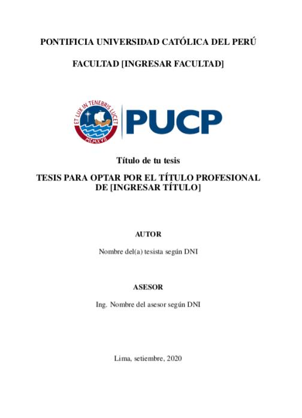

# Plantilla Tesis y trabajo de investigación PUCP 2023

# [Actualización 2023-03-04] Se recomienda usar Typst para una más fácil ejecución de la plantilla.

Plantilla Tesis Pontificia Universidad Católica del Perú, usualmente para ingeniería.

- Plantilla modificada al nuevo formato: Pablo Díaz

- La plantilla puede ser usada tanto para Tesis como para trabajo de investigación. Seleccionar alguno dentro del archivo `main.typ`

# Cómo usar la plantilla?

1. Descarga este repositorio como zip [aquí](https://github.com/ZurMaD/plantilla_tesis_pucp/archive/master.zip)
2. Extrae el contenido en una carpeta
3. Instala Typst:
   1. Ve a la siguiente página https://github.com/typst/typst/releases
   2. Dale clic a la sección assets del último release
   3. Dale clic al archivo que contenga el nombre de tu sistema operativo (Windows, Linux, Mac) 
   4. Extrae el ejecutable y ejecútalo
4. Instala un editor de texto [Visual Studio Code](https://code.visualstudio.com/)
   1. Instala la extensión de Typst para VSCode llamada (Typst LSP).
   2. Instala la extensión "vscode-pdf" para visualizar el pdf generado.
   3. Abre la carpeta con este programa.
   4. Abre el archivo `main.typ` y comienza a escribir (el archivo pdf se generará solo cada vez que guardes el archivo)

# Referencia de uso

# Ejemplos de uso

- Clic aquí [TFC1 & TFC2](https://github.com/ZurMaD/tesis_pregrado_pucp)
